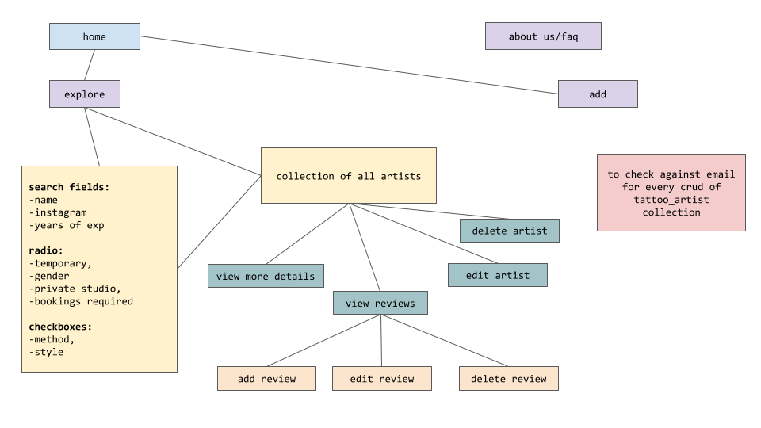
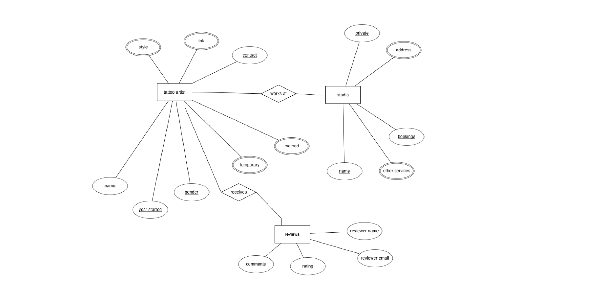

# TATTOOFINDWHO

The live demo of the site is available [here](https://tattoofindwho.netlify.app/).

## Project Summary
This website aims to serve as a source of reference for users interested in getting a tattoo or just discovering tattoo artists in Singapore.

This website could also serve as a platform for newer tattoo artists to increase visibility to potential clients.

The main target audience intended would be:
* Individuals above 18 looking for a tattoo artist 
* Tattoo artists interested in growing their clientele
* Individuals generally interested in looking at tattoos and discovering new tattoo artists

### <b>Organisation's Goals</b>
* To provide a platform for the compilation of tattoo artists in Singapore as currently, no such platform exists and tattoo artists not tagged to any studios might be hard to discover

### <b>User's Goals</b>
* Users should be able to easily obtain information about the various artists in Singapore, such as their contact information as well as their portfolio. 
* They should also be able to view the reviews left behind by previous clients to help them better make an informed decision.

## The Five Planes of UI/UX
### <b>1. Strategy</b>
#### Organisation
* Objective: To provide information about the available tattoo artists in Singapore

#### Users: Potential clients and tattoo artists
* Objective: To discover the various tattoo artists in Singapore and view their portfolio of works
* Needs:
    * To search about the tattoo artists, and the various methods and/or styles
    * Tattoos artist to create their own listing and potentially gain a greater customer base/following
    * To be able to leave reviews and view reviews left by other people
* Pain points:
    * Need to find out about the tattoo artists offering the method(s) and style(s) of tattoo they are interested in
    * Need to find out about whether bookings are required beforehand

 User Stories    | Acceptance Criteria(s)    
 -------------   | ---------------------      
As someone interested in getting a tattoo, I am concerned about whether the tattoo artist offers my style(s) and/or method(s) and/or ink(s) of interest, and if bookings are required beforehand.| <ul><li>Listings to be searchable by styles, methods, ink, and if bookings are required prior</li></ul>
As someone planning to get a tattoo on a possibly intimate area, I would be concerned about whether the studio offers a private space, about the gender of the tattoo artist, and also to read available reviews | <ul><li>Listings to be searchable by the tattoo artist's gender and whether the studio is private</li><li>Each tattoo artist to have a review section for users to freely view and add reviews</li></ul>
As a tattoo artist looking to gain exposure and potentially increase my customer base, I would want to be able to showcase my works and be easily contactable if there are potential interested clients. | <ul><li>A create form to allow users to add their contact information, reference image link & display artists by their instagram handle</li></ul>

<b> Features based on user stories:</b>

1. Create a new tattoo artist listing
2. Update the tattoo artist listing
3. Delete a tattoo artist listing
4. View all tattoo artist listings and narrow the search by search criterias
5. View reviews tagged each tattoo artist
6. Add, edit or delete a review tagged to a particular tattoo artist

### <b> 2. Scope</b>

<b>Content</b>

Content from the website is largely dependent on contribution from the general public. Contributions will be stored in a database, hence a backend server is required for communication between React and MongoDB. 

An Express server has been set up and deployed to Heroku, and API endpoints are accessible via the base [link](https://etys-tattoo-artists.herokuapp.com/).

The github repository for the restful API can be found [here](https://github.com/evelyntys/project-2-restful-api).

<b>Functional Requirements</b>
* Search filters to include:
    * Artist name
    * Artist's instagram handle
    * Studio name
    * Gender
    * Years of experience
    * Whether they are an apprentice
    * Whether they offer temporary or permanent tattoos
    * Methods
    * Inks
    * Styles
    * Whether bookings are required
    * Whether the studio is private
* Create new tattoo artist listing
* Edit and delete for each tattoo artist listing
* Reviews for each tattoo artist listing
    * Create, read, update and delete for each review
* Each listing and review will be tagged to a specific owner, and the same email has to be provided before modifications/deletions can occur

<b>Non-functional Requirements</b>
* Mobile responsiveness: the site's functionality should still remain on mobile version and their experience should still be optimized
* Loading gif to indicate that the site is still retrieivng data from the restful API

### <b> 3. Structure</b>
Below shows the skeleton structure of the web application in the early stages of brainstorming.

Attached is a draft image describing the entities and attributes to serve as a guide when constructing the database.

### <b> 4. Skeleton</b>
An initial wireframe of the site layout has been attached [here](tattoo-artists/readme/wireframe.pdf) for reference.

### <b> 5. Surface</b>
* The main colours used in this website include black, white and dark red to create a sleek and consistent look with a mature theme.
* Fonts used in this website include:
    * Raleway for general body text
    * Poiret One for headings 

## Testing
Details for the test cases can be found [here](tattoo-artists/readme/test-cases.pdf).

## Technologies Used
<b>Backend</b>
* [MongoDB](https://www.mongodb.com/) as the database to create a restful API
* [Express & NodeJS](https://expressjs.com/) as the framework for API endpoints
* [cors middleware](https://expressjs.com/en/resources/middleware/cors.html) to enable CORS
* [dotenv](https://www.npmjs.com/package/dotenv) for .env file containing environment variables

<b>Frontend</b>
* HTML/CSS
* [React](https://reactjs.org/) for the frontend framework
* [Axios](https://github.com/axios/axios) for calling API and getting data from promises
* [Bootstrap v5.2](https://getbootstrap.com/) for general styling of the website
* [React Bootstrap](https://react-bootstrap.github.io/) for reactive components such as Accordions, Modals and Navbar.
* [Bootstrap icons](https://icons.getbootstrap.com/)
* [React-Select](https://react-select.com/home) for multi-select drop-down

<b>Platforms and Softwares</b>
* [Github](https://github.com/) for the repository and version control
* [Gitpod](https://gitpod.io/) for code editing
* [Heroku](https://www.heroku.com/) to deploy Express server
* [Netlify](https://www.netlify.com/) to deploy React app

## Credits
#### Images and icons
1. Tattoo logo: <a href="https://www.flaticon.com/free-icons/tattoo" title="tattoo icons">Tattoo icons created by cube29 - Flaticon</a>
2. [Google Fonts](https://www.fonts.google.com)
3. [Landing page header](https://www.pexels.com/video/hands-art-creative-hand-4125837/)
4. [FAQ header](https://www.pexels.com/photo/person-holding-white-and-red-card-4123737/)
5. [Add new header](https://www.pexels.com/photo/woman-in-black-shirt-holding-black-smartphone-4123827/)
6. [Explore header](https://www.pexels.com/photo/a-topless-man-leaning-on-white-metal-handrails-5319874/)
8. [Edit header](https://www.pexels.com/photo/back-view-of-a-woman-getting-a-tattoo-on-her-arm-5088466/)
7. [Loader](https://loading.io/spinner/bars/-bounce-bar-column-chart-equalizer-histogram-rectangle-block-progress-facebook)
8. [Shotsnapp](https://app.shotsnapp.com/) for creation of device mockups
9. Tattoo images taken from the instagrams of the tattoo artists

#### Adapted codes/functionality
1. [Display images from Google Drive](https://support.awesome-table.com/hc/en-us/articles/115002196665-Display-images-from-Google-Drive)
2. [ContactFields component](https://bapunawarsaddam.medium.com/add-and-remove-form-fields-dynamically-using-react-and-react-hooks-3b033c3c0bf5)
3. [Star Rating component](https://dev.to/michaelburrows/create-a-custom-react-star-rating-component-5o6)
4. Information for FAQ page from the various instagram stories archive of the different tattoo artists
5. Reference for tattoo styles
    1. https://www.vectornator.io/blog/tattoo-styles/
    2. https://www.10masters.com/en/blog/tattoo-styles/
    3. https://my.dailyvanity.com/trends/tattoo-style-guide/
6. [Progress bar for add new artist & edit artist](http://bestjquery.com/tutorial/progress-bar/demo32/)

## Deployment
### <b>Backend</b>
Deployment for express server was completed using [Heroku](https://www.heroku.com/).

### <b>Frontend</b>
Deployment for React app was completed using [Netlify](https://www.netlify.com/).
